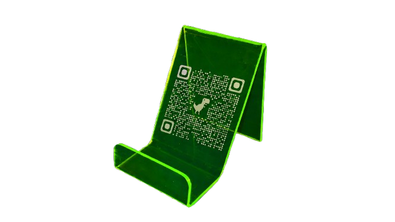

# MY QR | Modern Digital Menu Solutions



A premium, high-performance digital menu platform designed for the modern hospitality industry in Addis Ababa, Ethiopia. **MY QR** transitions traditional restaurants into the digital age with seamless, intuitive, and visually stunning interactive menus.

## 🚀 Key Features

- **Full-Stack Platform**: Integrated ordering features, payment functionality, and customer login.
- **Dynamic Admin Panel**: Real-time menu updates and table management.
- **Premium Hardware**: High-quality QR table stands for a complete digital transition.
- **Optimized Performance**: Smooth scroll-triggered animations and responsive glassmorphism UI.
- **Ethiopian Context**: Tailored for the local market in Addis Ababa.

## 🛠️ Tech Stack

- **Frontend**: HTML5, CSS3 (Tailwind CSS), JavaScript (Vanilla).
- **Icons**: Lucide Icons.
- **Animations**: Custom scroll-triggered frame-by-frame canvas engine.
- **Typography**: Space Grotesk, DM Sans, JetBrains Mono.

## 📦 Installation & Deployment

This is a static website. To run it locally:

1. Clone the repository:
   ```bash
   git clone https://github.com/mikiasdereje/MY_QR.git
   ```
2. Open `index.html` in any modern web browser.

For hosting, we recommend **GitHub Pages**, **Netlify**, or **Vercel**.

## 📞 Contact

**Mikias Dereje**
- **Phone**: +251 911 770 263
- **Telegram**: [@my_qr_menuet](https://t.me/my_qr_menuet)
- **Location**: Addis Ababa, Ethiopia

---
© 2026 MY QR ETHIOPIA // MODERN HOSPITALITY SYSTEMS
